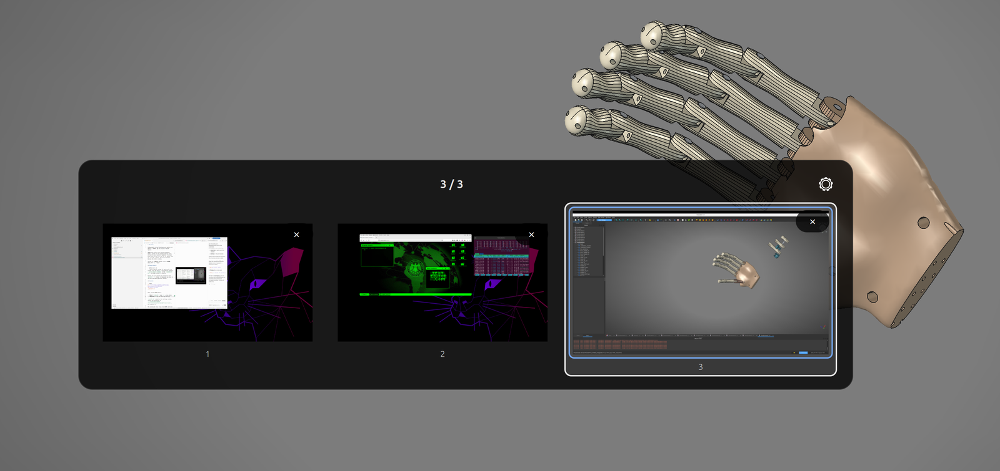
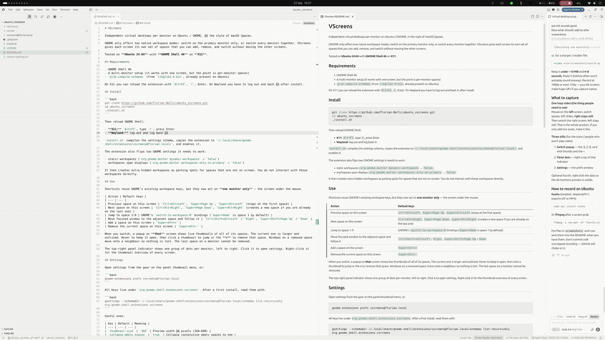

# VScreens

**Independent virtual desktops per monitor on Ubuntu / GNOME** — like macOS Spaces, but each screen has its own stack.

If you searched for *Ubuntu workspaces on one monitor only*, *separate virtual desktops per display*, or *GNOME workspaces not switching all screens together*, this is that.

GNOME normally does one of two things: only the primary display changes, or **every** display changes together. VScreens does neither. It is a virtual screen manager: you switch the monitor under the mouse; the other screens stay exactly where they are.



*The switch popup lives on the monitor you just changed. Live thumbnails, close with ×, settings via the gear.*



*Switching spaces on one monitor. The other monitor does not move.*

Tested on **Ubuntu 24.04** with **GNOME Shell 46** on **X11** and **Wayland**. Works with two or more monitors; a single screen still gets addable/removable spaces.

## Requirements

- GNOME Shell 46
- A multi-monitor setup (it works with one screen, but the point is per-monitor spaces)

## Install

The GNOME Extensions website listing is not up yet. Until then, install from git:

```bash
git clone https://github.com/Florian-Bolli/ubuntu_vscreens.git
cd ubuntu_vscreens
./install.sh
```

`install.sh` copies the extension to `~/.local/share/gnome-shell/extensions/vscreens@florianbolli.ch/` and enables it.

Then reload GNOME Shell:

- **X11:** `Alt+F2`, type `r`, press Enter
- **Wayland:** log out and log back in

**From a zip** (the same bundle that will go on the store). Download `vscreens@florianbolli.ch.shell-extension.zip` from the latest [Actions](https://github.com/Florian-Bolli/ubuntu_vscreens/actions/workflows/pack.yml) run on `main`, then:

```bash
gnome-extensions install --force vscreens@florianbolli.ch.shell-extension.zip
gnome-extensions enable vscreens@florianbolli.ch
```

Or GNOME’s **Extensions** app → menu → **Install from File…**. Then reload as above. To build the zip yourself: `./pack.sh`.

**From the GNOME Extensions website** — not listed yet. After review, this will be the usual install.

The extension also flips two GNOME settings it needs to work:

- static workspaces (`org.gnome.mutter dynamic-workspaces` → `false`)
- workspaces span displays (`org.gnome.mutter workspaces-only-on-primary` → `false`)

It then creates extra hidden workspaces as parking spots for spaces that are not on screen. You do not interact with those workspaces directly.

## Use

Shortcuts reuse GNOME’s existing workspace keys, but they now act on **one monitor only** — the screen under the mouse.

**Switching.** Bind whatever you like to GNOME’s “Switch to workspace left/right” actions. Defaults include `Ctrl+Alt+Left` / `Right` and `Super+Page Up` / `Page Down`. Mouse side buttons work well for this: map Back/Forward to those same actions in GNOME Settings or a remapper (that is how the author switches).

**Moving a window.** Hold **Shift** with the same switch shortcut. That is stock GNOME (`Move to workspace left/right`); VScreens just makes it apply to one monitor and follows the window there. So `Ctrl+Shift+Alt+Left` / `Right`, or `Super+Shift+Page Up` / `Down`. If you switch with mouse side buttons, bind Shift+those buttons to the move actions, or use the keyboard Shift combo.

| Action | Default keys |
| --- | --- |
| Previous space on this screen | `Ctrl+Alt+Left`, `Super+Page Up`, `Super+Alt+Left` (stops at the first space) |
| Next space on this screen | `Ctrl+Alt+Right`, `Super+Page Down`, `Super+Alt+Right` (creates a new space if you are already on the last one) |
| Jump to space 1–9 | GNOME’s `switch-to-workspace-N` bindings (`Super+Home` is space 1 by default) |
| Move focused window and follow it | **Shift** + your switch shortcut |
| Add a space on this screen | `Super+Alt+=` |
| Remove the current space on this screen | `Super+Alt+-` |

When you switch, a popup on **that** screen shows live thumbnails of all of its spaces. The current one is larger and outlined. Hover to keep it open, then click a thumbnail to jump or the **×** to remove that space. Windows on a removed space move onto a neighbour so nothing is lost. The last space on a monitor cannot be removed.

The top-right panel indicator shows one group of dots per monitor, left to right. Click it to open settings. Right-click it for the thumbnail overview of every screen.


## Update

```bash
cd ubuntu_vscreens
git pull
./install.sh
```

Reload the shell again (`Alt+F2` → `r` on X11, or log out on Wayland). When the store listing is live, you can update there instead.

## Uninstall

Turn it off in **Extension Manager** or:

```bash
gnome-extensions disable vscreens@florianbolli.ch
rm -rf ~/.local/share/gnome-shell/extensions/vscreens@florianbolli.ch
```

Reload the shell. Then restore GNOME’s workspace settings if you want the stock behaviour back:

```bash
gsettings set org.gnome.mutter dynamic-workspaces true
gsettings set org.gnome.mutter workspaces-only-on-primary true
gsettings set org.gnome.desktop.wm.preferences num-workspaces 4
```

## How it works

Mutter workspaces are global: a window belongs to one workspace, or to all of them. There is no native per-monitor workspace.

VScreens keeps every visible window on workspace 0 (the “stage”) and parks off-screen spaces on hidden workspaces that are never activated. Switching a monitor parks its current windows and brings the next space onto the stage. The slide uses GNOME’s own `MonitorGroup` animation, built for one monitor only, so the other screens do not move.

## Development

```bash
./install.sh
# then Alt+F2 → r
```

The extension source is `vscreens@florianbolli.ch/`. After edits, reinstall and reload.

To build the store zip (`vscreens@florianbolli.ch.shell-extension.zip`):

```bash
./pack.sh
```

Every push and pull request to `main` also runs `./pack.sh` in GitHub Actions and attaches that zip as an artifact.

Upload that file at [extensions.gnome.org/upload](https://extensions.gnome.org/upload/). Do not zip the git repo or the extension folder by hand.

## License

[MIT](LICENSE). Use it however you like; keep the copyright notice so Florian Bolli is mentioned.

## Contact

Feel free to contact me — questions, ideas, or if something breaks.

- GitHub: [Florian-Bolli](https://github.com/Florian-Bolli) · [open an issue](https://github.com/Florian-Bolli/ubuntu_vscreens/issues)
- Email: [mail@florianbolli.ch](mailto:mail@florianbolli.ch)
